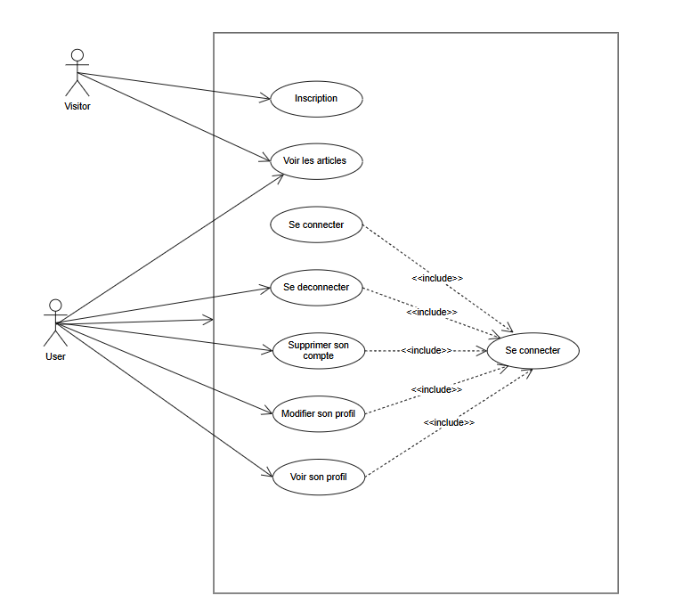
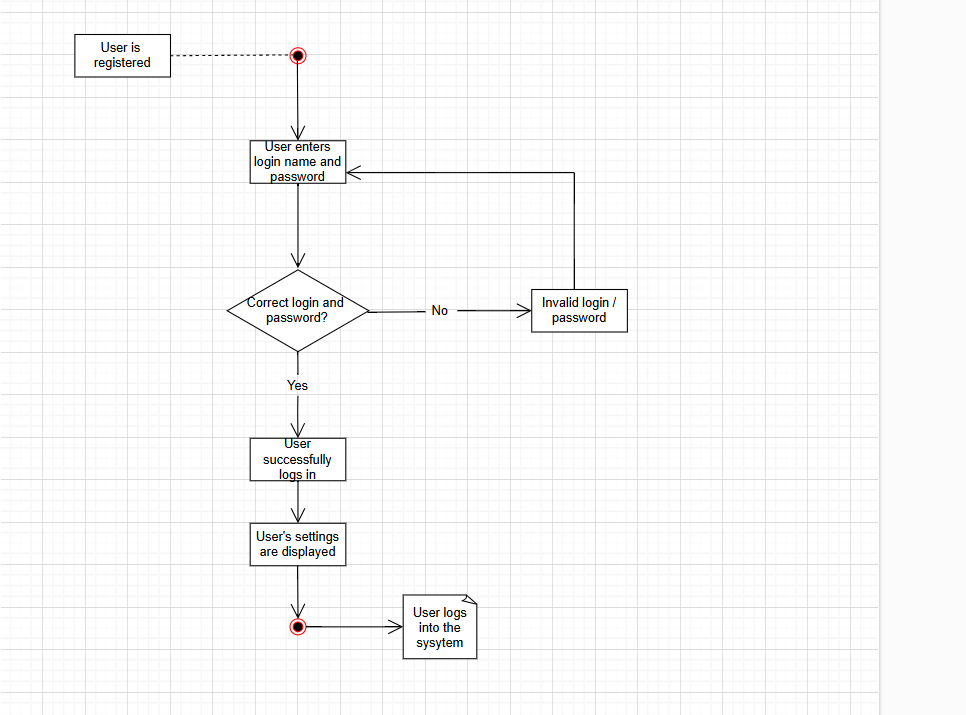
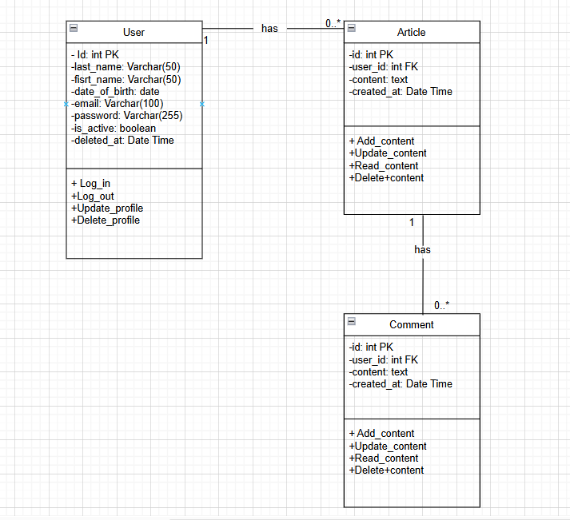
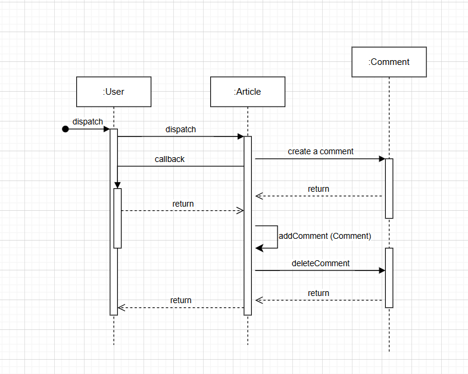

# POO-Management-PHP

## Cahier des Charges : Développement d'une Application web PHP natif

<strong>1. Contexte et Objectifs</strong>

Le projet vise a entrainer les competences de la POO en php natif et en architecture MVC, en creant un systeme d'articles de blogs avec des utilisateurs

<strong>2. Périmètre du Projet</strong>
 
Le developpement cuovre la creation d'une application web suivant l'architecture MVC, avec des fonctionnalites de gestion d'utilisateurs, de publications d'articles de blogs, de commentaires.

<strong>3. Descriptif fonctionnel</strong>
 
<strong>a. Mur Commun</strong> 
 
* **Fonctionnalite** : Un flux d'articles de blofs accessible a tous, affiche de maniere chronologique.
* **Details** : Affichage des articles avec nom et prenom, contenut et date.
 
Ordre : dernieres publications en premier.

<strong>a. Gestion des Utilisateurs</strong> 
 
* **Inscription et Connexion** : Champs requis (Last Name, First Name, Date of Birth, Email, Profil picture)
 

<strong>4. Contraintes Techniques</strong>

### Explications détaillées de l'architecture

<strong>5. User Stories et Critères de Validation</strong>

<strong>Organigramme : </strong>

<strong>Schéma de la base de données (MPD) :</strong>

<strong>Cas d'utilisation
 : </strong>

 User case : 

 Diagramme d'activitee : 

 

Diagramme de classe : 

Diagramme de sequence semantique :

